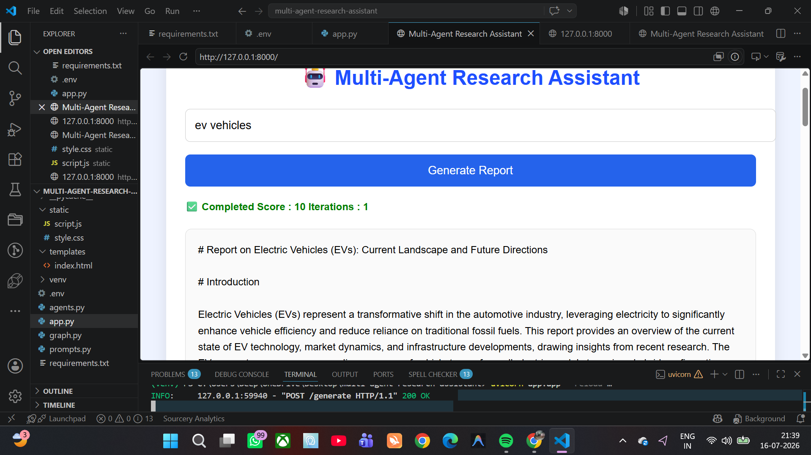
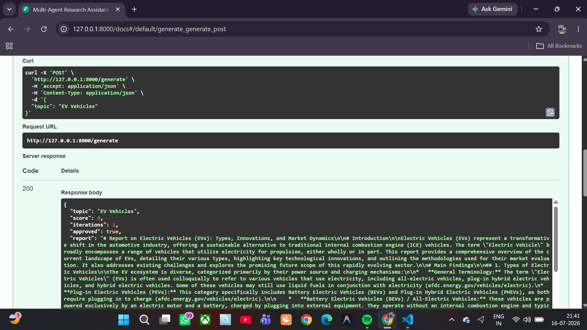

# 🤖 Multi-Agent Research Assistant

An AI-powered research assistant where multiple AI agents collaborate to research a topic, generate a structured report, review its quality, and improve it through iterative feedback.

## 🚀 Features

- 🔍 Researcher Agent (Tavily Search)
- ✍️ Writer Agent (Gemini)
- 📝 Critic Agent for quality review
- 🎯 Supervisor workflow using LangGraph
- 🔄 Automatic revision loop
- ⚡ FastAPI + HTML/CSS/JavaScript frontend

## 🛠️ Tech Stack

- Python
- LangGraph
- LangChain
- Google Gemini
- Tavily Search API
- FastAPI
- HTML, CSS, JavaScript

## 📸 Screenshots

### Home Page



### Generated Report



## ▶️ Run Locally

```bash
git clone https://github.com/Deep7991/multi-agent-research-assistant.git

cd multi-agent-research-assistant

pip install -r requirements.txt

uvicorn app:app --reload
```

Create a `.env` file:

```env
GOOGLE_API_KEY=YOUR_GEMINI_API_KEY
TAVILY_API_KEY=YOUR_TAVILY_API_KEY
```

Open:

```
http://127.0.0.1:8000
```

## 📌 Project Workflow

**User → Supervisor → Researcher → Writer → Critic → Final Report**